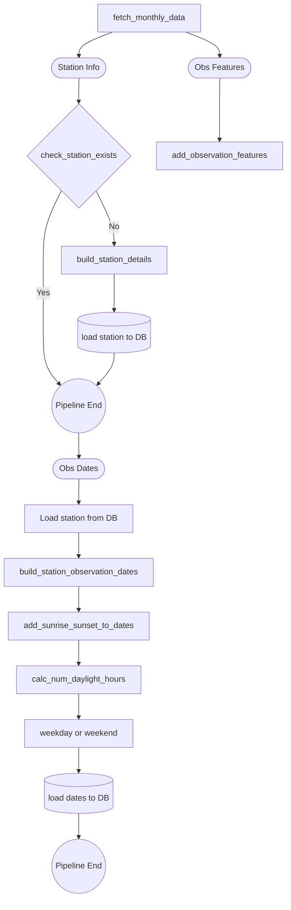
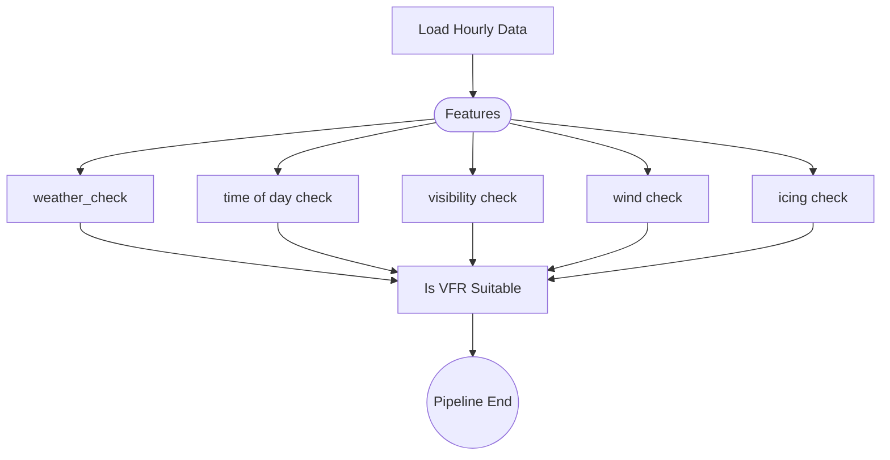

# METAR Station Data Processing

[Mermaid.js basic syntax](https://mermaid-js.github.io/mermaid/#/./flowchart?id=flowcharts-basic-syntax)

## Raw Data Pipeline

## Hour Aggregation Pipeline

## VFR Suitable Pipeline

